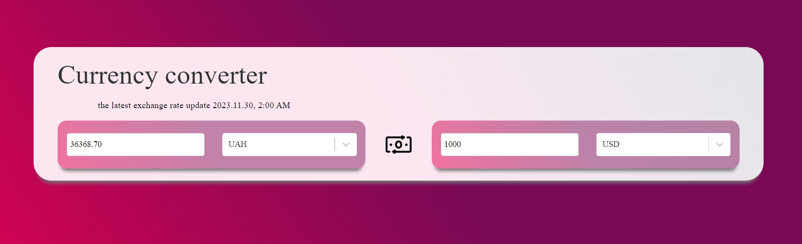

# Currency converter 
A currency converter is a tool that allows you to convert one currency into another, based on the current exchange rate. For example, if you want to know how much 100 US dollars are worth in euros, you can use a currency converter to find out. A currency converter can be useful for travelers, traders, investors, or anyone who needs to deal with different currencies.


## API Reference

#### Get all rates

```http
GET https://v6.exchangerate-api.com/v6/YOUR-API-KEY/latest/USD
```


## Authors
Iryna Artymuk


## Screenshots



## Tech Stack
**Client:** axios
,react,react-dropdown,react-select
,react-spinners,styled-components


